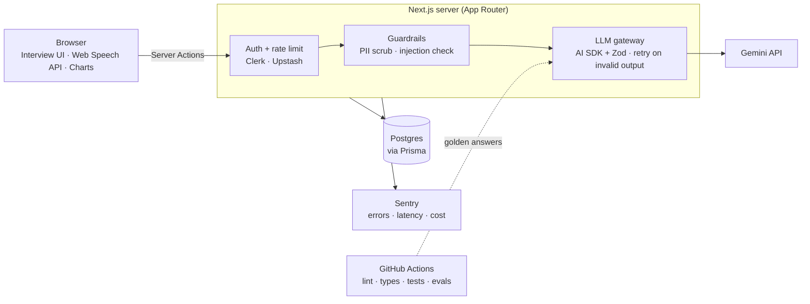

# Callback

**An AI interview coach.** Paste a job description and get a mock interview built for that role, STAR feedback on every answer, and a story bank you practice from beats instead of memorized scripts.

> **Status:** In active development for the Frontend Queens challenge (Sep 28 – Oct 11, 2026). Progress is tracked on the [project board](../../projects).

**Live demo:** _coming after Day 1 deploy_ · **Demo GIF:** _coming Day 13_

---

## Why this exists

Most AI interview tools just generate a list of questions. Callback is built around two ideas that make practice stick:

- **Practice from beats, not scripts.** Every story is reduced to 3–5 beats. You practice with the script hidden, and Callback checks which beats you actually covered. Memorized word-for-word answers fall apart under follow-up questions; beats don't.
- **Honest gap answers.** Callback maps a job's must-have skills to the stories you already have, flags the ones you can't back up yet, and helps you write a straight answer: name the gap, show related evidence, explain how you'd ramp up.

## Features

| Feature | What it does | Status |
| --- | --- | --- |
| JD → Interview Plan | Extracts role, level, and must-have skills from a job description and generates behavioral, technical, and role-specific questions | Planned |
| Mock interview | One question at a time, timed, answered by typing or voice | Planned |
| STAR feedback | Scores Situation / Task / Action / Result (1–4), names one fix, and streams a stronger rewrite | Planned |
| Voice + speech metrics | Browser speech-to-text with words-per-minute and filler-word counts | Planned |
| Story bank + beats | Save STAR stories, generate beats, practice with the script hidden | Planned |
| Warm-up | A 5-minute pre-interview routine to build confidence | Planned |
| Gap Coach | Skill coverage map and honest gap answers | Planned |
| Progress dashboard | Score trends by STAR part and the weakest area to practice next | Planned |
| Privacy controls | PII scrubbing, retention setting, delete-my-data | Planned |

## How it works



- **One gateway for every model call.** Every request goes through `src/lib/ai/gateway.ts`, which asks the model for JSON matching a Zod schema, validates it, and retries once if it doesn't match. The UI never renders unvalidated model output.
- **Guardrails before the model.** Auth, per-user rate limits, and a PII scrubber run before any text leaves the server.
- **Evals in CI.** A set of graded sample answers runs against the real feedback prompt. If a prompt change pushes scores outside the expected ranges, the build fails.

## Engineering decisions

I record significant technical decisions as **ADRs (Architecture Decision Records)**: short documents that capture the context, the options considered, the decision, and its trade-offs. They live in [`docs/adr/`](docs/adr).

| ADR | Decision |
| --- | --- |
| [0001](docs/adr/0001-stack.md) | Next.js App Router + Prisma + Clerk + Gemini via the Vercel AI SDK |


## Privacy

- Callback uses the Gemini API **free tier**, and Google may use free-tier inputs to improve its products. Don't paste sensitive personal information. Callback also strips emails, phone numbers, and URLs before any model call.
- Users can delete all of their data from Settings.
- Voice is transcribed in the browser with the Web Speech API. Callback never uploads audio.

## Tech stack

| Layer | Tools |
| --- | --- |
| Framework | Next.js (App Router), React, TypeScript (strict) |
| UI | Tailwind CSS, shadcn/ui, Recharts |
| Auth | Clerk |
| Data | PostgreSQL (Neon), Prisma |
| AI | Vercel AI SDK, Google Gemini (Flash-Lite), Zod |
| Voice | Web Speech API |
| Safety | Upstash Rate Limit, custom PII scrubber |
| Testing | Vitest, React Testing Library, Playwright, custom eval runner |
| Ops | GitHub Actions, Vercel, Sentry |

## Getting started

### Prerequisites

- Node.js (current LTS) and npm
- A [Neon](https://neon.tech) Postgres database (free tier)
- A [Clerk](https://clerk.com) application (free tier)
- A [Google AI Studio](https://aistudio.google.com) API key (free tier)

### Setup

```bash
git clone https://github.com/olivcamj/callback.git
cd callback
npm install
cp .env.example .env.local   # fill in the values
npx prisma migrate dev
npm run dev
```

Open http://localhost:3000.

### Environment variables

| Variable | Where to get it |
| --- | --- |
| `DATABASE_URL` | Neon dashboard → Connection string |
| `NEXT_PUBLIC_CLERK_PUBLISHABLE_KEY` | Clerk dashboard → API keys |
| `CLERK_SECRET_KEY` | Clerk dashboard → API keys |
| `GOOGLE_GENERATIVE_AI_API_KEY` | Google AI Studio → Get API key |
| `GEMINI_MODEL` | Model ID, default `gemini-3.1-flash-lite` |
| `UPSTASH_REDIS_REST_URL` / `UPSTASH_REDIS_REST_TOKEN` | Upstash console _(Day 11)_ |
| `SENTRY_DSN` | Sentry project settings _(Day 11)_ |

### Scripts

| Command | What it does |
| --- | --- |
| `npm run dev` | Start the dev server |
| `npm run build` | Production build |
| `npm run lint` | ESLint |
| `npm run typecheck` | `tsc --noEmit` |
| `npm test` | Vitest unit and component tests (single run, used in CI) |
| `npm run test:watch` | Vitest in watch mode while developing |
| `npm run test:e2e` | Playwright end-to-end tests |
| `npm run eval` | Run the LLM eval suite against golden answers |

## Testing

Every feature ships with tests in the same PR, and CI runs them on every push.

| Layer | Tool | What it covers |
| --- | --- | --- |
| Unit | Vitest | Pure logic: speech metrics, PII scrubber, prompt-injection guard, Zod schemas, chart data transforms |
| AI gateway | Vitest + mocked model | Valid output passes, invalid output retries exactly once, two failures return a friendly error. No real API calls. |
| Component | Vitest + React Testing Library | What the user sees: feedback card states (loading, streaming, error), question stepper, empty states |
| End to end | Playwright + axe | Sign in → create a plan → answer → feedback, plus an accessibility scan |
| AI quality | Eval runner | Golden weak / OK / strong answers must score inside expected ranges |

**Not tested on purpose:** third-party internals (Clerk, shadcn/ui, Prisma). Async Server Components are covered by Playwright, because Vitest doesn't render them yet.

## Project structure

```
src/
  app/
    (marketing)/        landing page
    (app)/
      dashboard/        progress dashboard
      plans/            JD → Interview Plan
      sessions/         mock interview sessions
      stories/          story bank + beats practice
      warmup/           pre-interview warm-up
      settings/         privacy controls
  components/           UI components (shadcn/ui + custom)
  lib/
    ai/
      gateway.ts        the only place that calls the model
      schemas/          Zod schemas for every model response
      prompts/          system prompts
      scrub.ts          PII scrubber
    speech/metrics.ts   words per minute, filler words
    db.ts               Prisma client
prisma/schema.prisma
evals/                  golden answers + eval runner
e2e/                    Playwright tests
docs/adr/               Architecture Decision Records
```

## Roadmap

See the [project board](../../projects) and [milestones](../../milestones). Stretch ideas after the challenge: shareable session recaps, company-specific question sets, and interviewer personas.

## Built with AI tools

I use Claude and Cursor while building this project, and I review and test everything before it merges. Notes on what worked and what I had to correct are in `docs/cursor-notes.md` _(Day 9)_.

## License

MIT

---

Built by **Olivia Cameron** · [GitHub](https://github.com/olivcamj) · [Portfolio](https://oliviacameron.com)